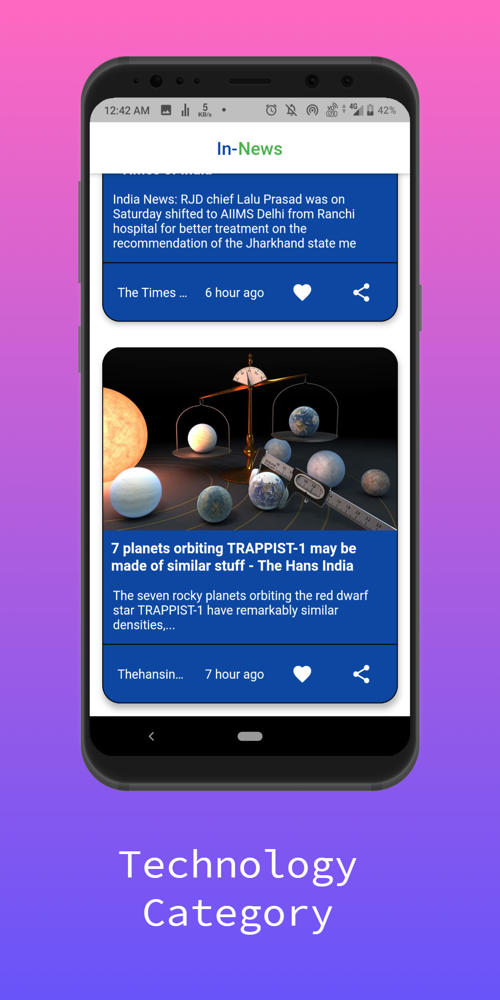

# news_app

A new Flutter application.

<h1>some screenshots</h1>

<table>
  <tr>
    <td></td>
    <td></td>
    <td></td> 
  </tr>
 </table>
 
 
## Technology Used
* https://img.shields.io/badge/flutter-98%25-yellowgreen
* https://img.shields.io/badge/flutter-98%25-yellowgreen

## Getting Started

This project is a starting point for a Flutter application.

A few resources to get you started if this is your first Flutter project:

- [Lab: Write your first Flutter app](https://flutter.dev/docs/get-started/codelab)
- [Cookbook: Useful Flutter samples](https://flutter.dev/docs/cookbook)

For help getting started with Flutter, view our
[online documentation](https://flutter.dev/docs), which offers tutorials,
samples, guidance on mobile development, and a full API reference.
